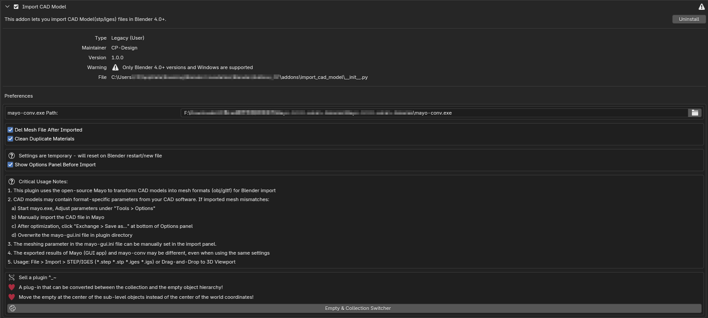

English | [中文](./中文.md)

# Import CAD Model for Blender

[](https://www.blender.org)
[](https://www.gnu.org/licenses/gpl-3.0)

A Blender addon that enables import of CAD files (STEP/IGES formats) through conversion to mesh formats using Mayo conversion toolkit.

![Plugin Demo] 

## Features

- 🚀 **CAD Format Support**
  - Import `.step`, `.stp`, `.iges`, `.igs` files
  - Supports both drag-and-drop and traditional file import
  
- ⚙️ **Conversion Options**
  - Choose between GLTF or OBJ
  - Adjustable mesh quality levels (Very Coarse → Very Precise)
  - Custom scaling factors (0.0001x to 100x)

- 🧹 **Automatic Cleanup**
  - Optional deletion of intermediate files
  - Duplicate material cleanup system

- 🖥️ **Workflow Optimization**
  - Real-time conversion progress monitoring
  - Preset system for frequent configurations
  - 3D viewport integration

## System Requirements

❗ **Windows Only**  
This addon requires  Windows 

1. **Mayo Conversion Tool**  
   Download Mayo-x.x.x-win64-binaries.zip or Mayo-x.x.x-win64-installer.exe from:  
   [https://github.com/fougue/mayo/releases](https://github.com/fougue/mayo/releases)

2. **Blender**  
	- **Blender**:4.0 and newer

## Installation

1. Download the latest `.zip` file from [Releases](https://github.com/chenpaner/Import-CAD-Model/releases).
2. In Blender, go to **Edit > Preferences > Add-ons**.
3. Click **Install...** and select the downloaded `.zip` file.
4. Enable the checkbox next to "Import CAD Model ".

5. **Configure Mayo Path**  
   ```python
   # In Blender Preferences:
   Add-ons > Import CAD Model 
   Set path to mayo-conv.exe in addon preferences
   ```

## Usage

### Basic Import
1. **File Import**
   ```
   File > Import > STEP/IGES (.step/.stp/.iges/.igs)
   ```

2. **Drag-and-Drop**
   - Drag files directly into 3D Viewport

### Conversion Settings
| Parameter          | Description                                                                 |
|--------------------|-----------------------------------------------------------------------------|
| **Output Format**  | `.gltf` (slow, hierarchy) / `.obj` (fast, collections)                      |
| **Mesh Quality**   | Controls BRep conversion precision (trade-off between speed and accuracy)  |
| **Global Scale**   | Adjust model scaling factor (0.0001-100)                                   |
| **Post-Process**   | Auto-delete temp files, clean duplicate materials                          |

## Languages supported
   - English
   - 中文
   - 日本語


## Todo
-  **Support opening multiple models at once**
-  **Automatically update models (instead of re-importing them)**


**Disclaimer**  
This addon is not affiliated with the Mayo project. CAD conversion quality depends on Mayo's core functionality.

