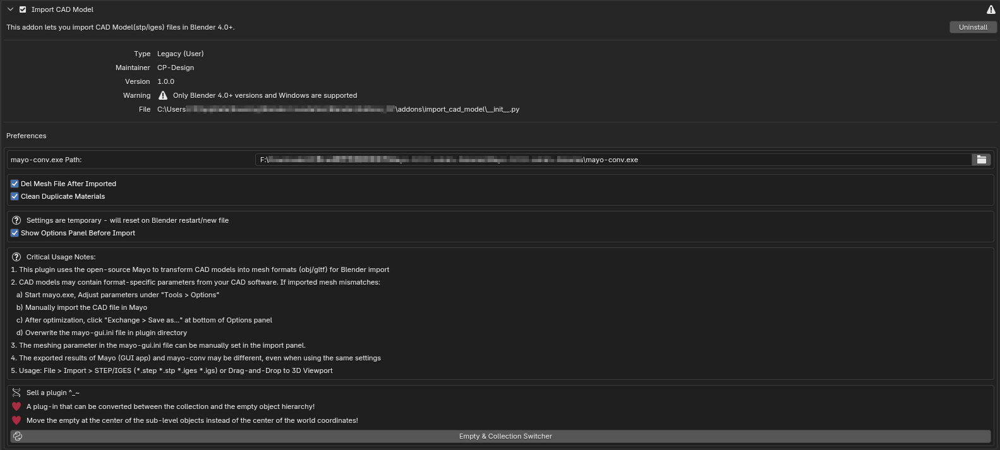
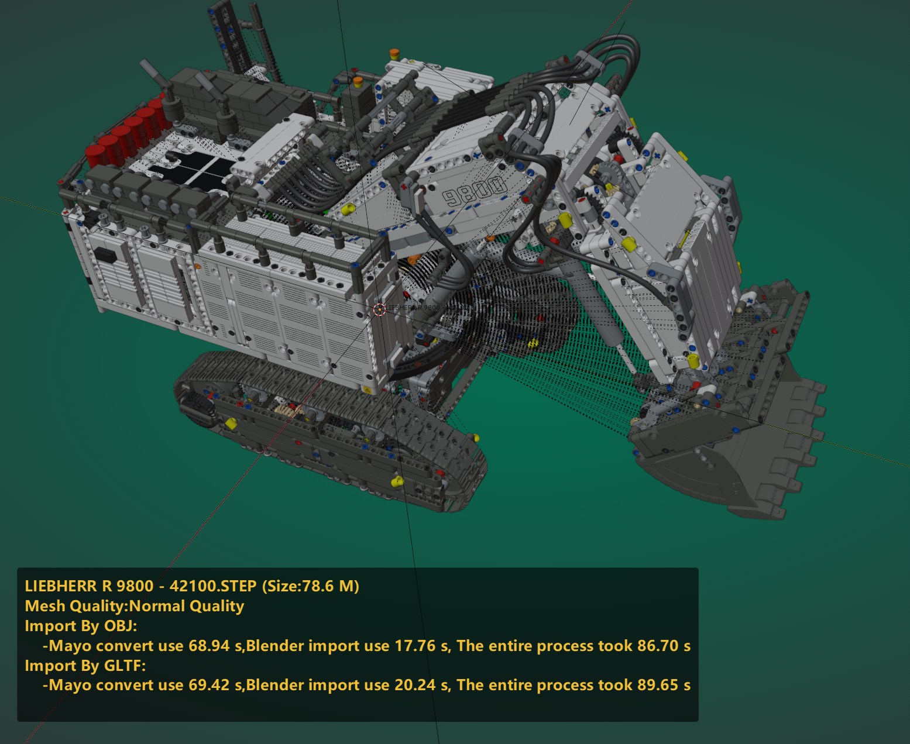

English | [中文](./中文.md)

# Import CAD Model for Blender

[](https://www.blender.org)
[](https://www.gnu.org/licenses/gpl-3.0)

 

A Blender addon that enables import of CAD files (STEP/IGES formats) through conversion to mesh formats using Mayo conversion toolkit.

Plugin Preferences 

Plugin Demo 

## Features

- 🚀 **CAD Format Support**
  - Import `.step`, `.stp`, `.iges`, `.igs` files
  - Supports both drag-and-drop and traditional file import
  
- ⚙️ **Conversion Options**
  - Choose between GLTF or OBJ
  - Adjustable mesh quality levels (Very Coarse → Very Precise)
  - Custom scaling factors (0.0001x to 100x)

- 🧹 **Automatic Cleanup**
  - Optional deletion of intermediate files
  - Duplicate material cleanup system

- 🖥️ **Workflow Optimization**
  - Real-time conversion progress monitoring
  - Preset system for frequent configurations
  - 3D viewport integration

## System Requirements

**Windows and macOS are supported.**

1. **Mayo Conversion Tool**  
   - **Windows**: Download Mayo-x.x.x-win64-binaries.zip or Mayo-x.x.x-win64-installer.exe from:  
     [https://github.com/fougue/mayo/releases](https://github.com/fougue/mayo/releases)
   - **macOS**: No prebuilt binaries are published, but Mayo builds fine from source
     (Qt and OpenCascade are both available via Homebrew):
     ```bash
     brew install cmake qt opencascade
     git clone --branch v0.10.0 https://github.com/fougue/mayo.git
     cmake -S mayo -B build-mayo -DCMAKE_BUILD_TYPE=Release -DMayo_BuildApp=OFF \
       -DQT_DIR="$(brew --prefix qt)/lib/cmake/Qt6"
     cmake --build build-mayo --target mayo-conv --parallel $(sysctl -n hw.ncpu)
     ```
     See also the official [Mayo macOS build instructions](https://github.com/fougue/mayo/wiki/Build-instructions-for-macOS).
     Only the `mayo-conv` CLI target is needed by this addon.

2. **Blender**  
	- **Blender**:4.0 and newer

## Installation

1. Download the latest `.zip` file from [Releases](https://github.com/chenpaner/Import-CAD-Model/releases).
2. In Blender, go to **Edit > Preferences > Add-ons**.
3. Click **Install...** and select the downloaded `.zip` file.
4. Enable the checkbox next to "Import CAD Model ".

5. **Configure Mayo Path**  
   ```python
   # In Blender Preferences:
   Add-ons > Import CAD Model 
   Set path to the mayo-conv executable in addon preferences
   (mayo-conv.exe on Windows, the built mayo-conv binary on macOS)
   ```


## Usage

### Basic Import
1. **File Import**
   ```
   File > Import > STEP/IGES (.step/.stp/.iges/.igs)
   ```

2. **Drag-and-Drop**
   - Drag files directly into 3D Viewport

Import time test 

### Conversion Settings
| Parameter          | Description                                                                 |
|--------------------|-----------------------------------------------------------------------------|
| **Output Format**  | `.gltf` (hierarchy) / `.obj` (collections)                      |
| **Mesh Quality**   | Controls BRep conversion precision (trade-off between speed and accuracy)  |
| **Global Scale**   | Adjust model scaling factor (0.0001-100)                                   |
| **Post-Process**   | Auto-delete temp files, clean duplicate materials                          |

## Languages supported
   - English
   - 中文
   - 日本語


## Todo
-  **Support opening multiple models at once**
-  **Automatically update models (instead of re-importing them)**


**Disclaimer**  
This addon is not affiliated with the Mayo project. CAD conversion quality depends on Mayo's core functionality.

## Support
You can support me directly via PayPal: [https://www.paypal.me/chenpaner](https://paypal.me/chenpaner?country.x=C2&locale.x=zh_XC)

Or you can check out one of my paid addons: https://blendermarket.com/creators/cp-design
