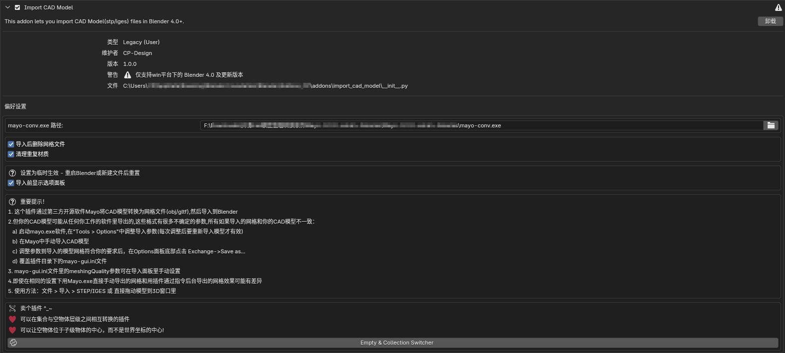

[English](./README.md) | 中文
# Blender 导入 CAD 模型插件

[](https://www.blender.org)
[](https://www.gnu.org/licenses/gpl-3.0)

一个 Blender 插件，通过使用 Mayo 转换工具包将 CAD 文件（STEP/IGES 格式）转换为网格格式以实现导入。

![插件首选项] 

![插件演示] 

## 功能

- 🚀 **支持 CAD 格式**
  - 导入 `.step`、`.stp`、`.iges`、`.igs` 文件
  - 支持拖放和传统文件导入
  
- ⚙️ **转换选项**
  - 可选择 GLTF 或 OBJ
  - 可调整的网格质量等级（非常粗糙 → 非常精细）
  - 自定义缩放系数（0.0001x 到 100x）

- 🧹 **自动清理**
  - 可选删除中间文件
  - 重复材质清理系统

- 🖥️ **工作流优化**
  - 实时监控转换进度
  - 常用配置预设系统
  - 3D 视口集成

## 系统要求

❗ **仅限 Windows**  
此插件需要 Windows 系统。

1. **Mayo 转换工具**  
   从以下地址下载 Mayo-x.x.x-win64-binaries.zip 或 Mayo-x.x.x-win64-installer.exe：  
   [https://github.com/fougue/mayo/releases](https://github.com/fougue/mayo/releases)

2. **Blender**  
   - **Blender**: 4.0 及更高版本

## 安装

1. **安装插件**
   - 下载最新版本的 `.zip` 文件：[Releases](https://github.com/chenpaner/Import-CAD-Model/releases)。
   - 在 Blender 中，进入 **编辑 > 偏好设置 > 插件**。
   - 点击 **安装...** 并选择下载的 `.zip` 文件。
   - 启用插件 "Import CAD Model "。

2. **配置 Mayo 路径**  
   ```python
   # 在 Blender 偏好设置中：
   插件 > 导入-导出 > Import CAD Model 
   在插件偏好设置中设置 mayo-conv.exe 的路径

## 使用方法

### 基本导入

1. **文件导入**
文件 > 导入 > STEP/IGES (.step/.stp/.iges/.igs)

2. **拖放**
- 将文件直接拖放到 3D 视口中

### 转换设置

| 参数         | 描述                                                                 |
|--------------|----------------------------------------------------------------------|
| 输出格式     | `.gltf`（空物体父子结构） / `.obj`（集合结构）               |
| 网格质量     | 控制 BRep 转换精度（速度与精度之间的权衡）                        |
| 全局缩放     | 调整模型缩放系数（0.0001 至 100）                                 |
| 后处理       | 自动删除临时文件，清理重复材质                                   |

## 支持的语言

- 英语  
- 简体中文  
- 日语  

## 待办事项

- **支持一次打开多个模型**  
- **自动更新模型（而不是重新导入模型）**  

## 免责声明

此插件与 Mayo 项目无关。CAD 转换质量取决于 Mayo 的核心功能。